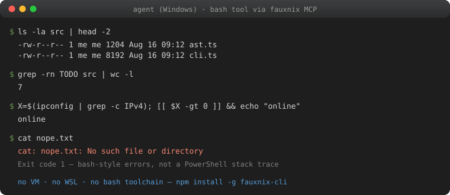

# fauxnix

[](https://github.com/20000419/fauxnix/actions/workflows/ci.yml)
[](https://www.npmjs.com/package/fauxnix-cli)
[](https://www.npmjs.com/package/fauxnix-cli)
[](LICENSE)
[](https://glama.ai/mcp/servers/20000419/fauxnix)

**Run Linux-style commands on Windows — natively, deterministically, with no VM and no WSL.**

fauxnix is a bash→PowerShell translation layer built for AI agents. Your agent keeps writing the
bash it already knows (`ls -la | grep foo`, `find . -name '*.ts' | wc -l`, `kill -9 1234`), and
fauxnix deterministically translates each command into PowerShell, executes it natively, and hands
back output that looks like GNU/Linux: `ls -l` columns, bash-style error messages, coreutils exit
codes, UTF-8/GBK handled automatically.

```bash
npm install -g fauxnix-cli    # then point any MCP harness at `fauxnix mcp`
```



```
$ fauxnix "ls -la src | head -2"
-rw-r--r-- 1 me me 1204 Aug 16 09:12 ast.ts
-rw-r--r-- 1 me me 8192 Aug 16 09:12 cli.ts

$ fauxnix "cat nope.txt"
cat: nope.txt: No such file or directory        # not a PowerShell stack trace
```

## Measured: your model is probably worse at PowerShell than you think

Same model (DeepSeek-V4-Pro), same 5 tasks, three execution modes on one Windows machine —
full data in [`docs/benchmark-deepseek-v4-pro.md`](docs/benchmark-deepseek-v4-pro.md) and
[`docs/benchmark-ark-models.md](docs/benchmark-ark-models.md):

| | PowerShell | **fauxnix** | Git Bash |
|---|---|---|---|
| tool calls / unexpected errors | 14 / 9 | **7 / 0** | 4 / 0 |
| time (T1–T4) | 163s | **66s** | 57s |

Across 7 models on the Volcano Ark Coding Plan, the PowerShell-vs-fauxnix gap held for every
model tested — worst case (kimi-k2-thinking): **3.1× slower with 24 error events** writing
PowerShell vs zero errors through fauxnix. fauxnix lands within ~15% of the real-bash ceiling
with no bash toolchain installed.

## Why

LLM agents are dramatically better at bash than at PowerShell — bash dominates training data, so
models on Windows often produce "looks right, doesn't run" commands (wrong quoting, `curl` that
isn't curl, mojibake from codepage mismatches, inscrutable `CategoryInfo` error dumps). Existing
solutions are either a full VM (WSL — heavy, wrong filesystem, separate environment) or plain
shell wrappers (still PowerShell underneath).

fauxnix takes the third road: **translate, don't emulate**. A large, high-value subset of the
Linux command line — file ops, text processing, process management, archives, networking basics —
maps cleanly onto PowerShell + .NET. fauxnix implements that subset faithfully and *fails loudly
and helpfully* on what it can't translate, so the agent never gets silently-wrong results.

Labs now train computer-use agents on fleets of real desktops. Reporting in 2026 (*The
Information*, widely repeated) has OpenAI buying tens of thousands of Mac mini / Mac Studio
boxes — no screen, no keyboard — to reinforcement-learn agents that click, edit, test, and
run bash workflows, and Anthropic renting Mac minis through AWS for the same class of work.
That scoring environment is macOS. Windows users should not have to install a guest Unix to
keep up: the agent keeps writing bash; fauxnix makes the Windows box answer like the box the
agent was trained on. See [`docs/rfc-computer-use-windows.md`](docs/rfc-computer-use-windows.md).

## Install

```bash
npm install -g fauxnix-cli
```

Or from source:

```bash
git clone https://github.com/20000419/fauxnix && cd fauxnix
npm ci
npm install -g .
```

> npm package name is `fauxnix-cli` (the `fauxnix` name on npm belongs to an
> unrelated 2015 websocket library); the installed command is still `fauxnix`.

Requires: Windows with PowerShell 5.1+ (built-in) and Node.js ≥ 18.

## Quick start

```bash
# one-off commands
fauxnix "ls -la"
fauxnix "grep -rn TODO src | wc -l"
fauxnix "cat log.txt | grep -i error | sort | uniq -c"

# see what a command becomes (great for debugging / learning PS)
fauxnix translate "find . -name '*.log' -mtime +7 -delete"

# check your environment
fauxnix check

# run the MCP stdio server (what agent harnesses connect to)
fauxnix mcp
```

Unknown commands (git, node, npm, python, cargo, gh, docker, ...) are **passed through natively**
with argv-style quoting — no string re-parsing, no quoting bugs.

## Use with your agent harness

fauxnix ships an MCP stdio server exposing a `bash` tool (plus `fauxnix_translate` and
`fauxnix_session`). Point any MCP-capable harness at it:

**Claude Code**
```bash
claude mcp add fauxnix -- fauxnix mcp
```

**Codex** (`~/.codex/config.toml` or `codex mcp add fauxnix -- fauxnix mcp`)
```toml
[mcp_servers.fauxnix]
command = "fauxnix"
args = ["mcp"]
```
Note: in non-interactive `codex exec` mode, MCP tool calls are auto-denied by
the approval layer; pass `--dangerously-bypass-approvals-and-sandbox` (or run
interactively and approve once).

**OpenCode** (`opencode.json`)
```json
{
  "mcp": {
    "fauxnix": { "type": "local", "command": ["fauxnix", "mcp"] }
  }
}
```

**Kimi Code** — unlike the others, MCP servers live in a JSON file, not the
TOML config: `~/.kimi-code/mcp.json`
```json
{
  "mcpServers": {
    "fauxnix": { "command": "fauxnix", "args": ["mcp"] }
  }
}
```

**Any MCP client** — stdio server: `fauxnix mcp`. The tool name is `bash` (override with
`FAUXNIX_TOOL_NAME`). Tool description already teaches the model the supported subset, so no
system-prompt changes are required.

The MCP session persists `cwd`, environment variables, `export`/`unset` and `cd -`/OLDPWD across
tool calls — it behaves like a logged-in shell, not a stateless `exec`.

## What's translated

~105 commands, all output-matched against real GNU coreutils on Windows (Git Bash) during
development:

- **files**: `ls cp mv rm mkdir rmdir touch mktemp ln readlink realpath basename dirname stat file du df find chmod chown diff`
- **text filters**: `grep egrep sed awk sort uniq cut tr` — sed/awk scripts are parsed at
  translate time (unsupported constructs throw named errors, never silently misbehave)
- **text I/O**: `echo printf cat head tail wc tee nl tac md5sum sha1sum sha256sum base64 seq yes xargs`

`cp` / `mv` / `rm` / `touch` / `du` / `ls` / `ll` / `mkdir` / `rmdir` / `mktemp` / `ln` /
`readlink` / `realpath` / `basename` / `dirname` / `stat` / `file` / `df` / `chmod` / `chown` /
`diff` / `tee` / `grep` / `head` / `echo` / `printf` / `cat` / `tail` / `wc` carry a `CommandSpec`: unknown options fail with a GNU-style
usage error instead of being ignored (`find` stays unspec'd so predicates like `-name` still
compile). Implemented GNU holes: `cp -n` / `mv -n` / `touch -c` / `tee --append` / `grep -m` /
`head --lines` / `du --max-depth`. `fauxnix list --json` and `docs/command-specs.md` dump the
same metadata.
- **shell/system**: `cd pwd export unset env printenv ps kill pkill pgrep sleep which type whoami
  id groups date uname hostname uptime free nproc clear true false test [ [[ : pushd popd dirs sudo
  timeout man history less more source . eval exit alias set`
- **network**: `curl wget ping netstat ss ip ifconfig nslookup dig host`
- **archives**: `tar gzip gunzip zcat zip unzip`

Plus shell syntax: pipes, `&&` / `||` / `;`, redirections (`> >> 2> 2>&1 < &>`, `/dev/null`),
quoting, `$VAR` `$(...)` command substitution, `VAR=x cmd` prefixes, `~` expansion, and
POSIX-style path normalization (`/tmp`, `/d/foo` → `D:\foo`).

Exit codes follow bash conventions: 0 ok, 1 fail, 2 usage/serious, 127 command not found,
124 timeout.

## How it works

```
bash command ──parser──▶ AST ──translator──▶ PowerShell script ──executor──▶ powershell.exe
                                                                              │
agent ◀── GNU-style output, bash-style errors ◀── decoder (UTF-8 → GBK fallback) ◀┘
```

- **Deterministic translation, zero LLM calls** at runtime.
- Each command maps to a generator that emits a self-contained PowerShell block honoring the
  "Fauxnix contract": string-per-line stdout, `[Console]::Error.WriteLine` for bash-style
  stderr, `$script:fx_exit` for exit codes, `$input` for stdin.
- The executor wraps every script with UTF-8 enforcement (`[Console]::OutputEncoding`,
  `$OutputEncoding`, `chcp 65001`), decodes output as strict-UTF-8 with a GBK(936) fallback for
  legacy native tools, strips CLIXML serialization and PowerShell noise from stderr, and rewrites
  common PowerShell errors (including zh-CN locale messages) into bash phrasing.
- Scripts run via `-EncodedCommand` (UTF-16LE) and transparently fall back to a temp `.ps1` file
  when the 32 KB command-line limit would be exceeded.

## Known deviations (honest list)

fauxnix optimizes for the commands agents actually run. Documented deviations:

- `X=1` standalone assignments follow `export` semantics (one session-wide environment; bash's
  shell-var vs exported-var distinction does not exist), and a same-segment prefix is visible to
  `$VAR` inside the command's own words (`Z=in [[ $Z == in ]]` is true here, false in bash where
  word expansion precedes the temporary environment).
- `yes` is capped at 65,536 lines — PS 5.1 pipelines cannot signal upstream producers to stop, so
  an unbounded `yes | head` would hang.
- `tail -f`, `eval`, `alias`, heredocs, `while`/`until`/`case`,
  `env -i`/`--ignore-environment`,
  background `&`, and stdout redirects (`>` `>>` `&>` `&>>`) on a non-last
  pipeline stage (`echo hi >f | cat`) are rejected with actionable error
  messages instead of misbehaving.
  (`if/then/elif/else/fi`, `for x in ...`, backtick substitution, `command -v`, pipeline `read`,
  dotenv-style `source`, and word-level `$((...))` arithmetic expansion are supported.)
- `command -v <builtin>` prints `/usr/bin/<name>` where bash prints the bare builtin name;
  exit codes and empty-result semantics match.
- `chmod` maps only the read-only bit; exec bits are no-ops on Windows. `chown` is a silent no-op
  (as in Git Bash).
- `ps aux` columns are approximations (no per-process CPU% accounting, USER shows `?`).
- `gzip -c`/pipeline stdin is text-faithful, not byte-faithful; file-mode `gzip f` is byte-exact.
- A pipeline producing exactly one line, piped into `wc -l`, counts that line (bash would count 0
  if the producer omitted the trailing newline). `printf 'x' | md5sum` stays byte-exact.
- `sed`/`awk` support the common subset; hold-space, labels, arrays, loops throw named
  "not supported" errors at translate time.
- `curl`/`wget` refuse loopback/private/reserved addresses (localhost, 127.x, ::1, 10.x,
  172.16–31.x, 192.168.x, 169.254.x) as a safety default for agent-driven HTTP.
- **Native-tool pipelines vs encoding**: PS 5.1 has a single console-encoding knob, so
  piping localized admin tools (ipconfig, tasklist — GBK on zh-CN) and UTF-8-native dev
  tools (node, curl) cannot both decode cleanly mid-pipeline. Default favors UTF-8 dev
  tools; set `FAUXNIX_NATIVE_ENCODING=ansi` when your agents grep Chinese output of
  native Windows admin tools. **File reads are always sniffed per file** (UTF-8 strict →
  GBK fallback), so grep/sed/awk over GBK *files* works in either mode — unlike Git Bash,
  which only matches the encoding its locale assumes.

## Development

```bash
npm install
npm test          # unit + real-PowerShell integration suite (Windows only, auto-skipped elsewhere)
npm run build
npx tsx scratch/run.mjs "any bash command"   # quick live check
```

Architecture map: `src/parser.ts` (bash subset → AST) · `src/translator.ts` (AST → PowerShell +
executor wrapper) · `src/executor.ts` (spawn, redirects, session persistence) ·
`src/commands/*.ts` (per-command generators) · `src/mcp.ts` (MCP server) · `src/cli.ts`.

Roadmap: [docs/rfc-roadmap-to-1.0.md](docs/rfc-roadmap-to-1.0.md) — tracks, milestones,
and the RFC process for proposing waves.

## Security

Trust model, host protocol, kill semantics, network guard, and reporting:
[SECURITY.md](SECURITY.md).

## License

MIT © 20000419
